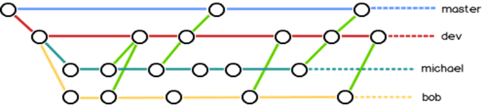

# Git版本控制

> git许多人习惯用复制整个项目目录的方式来保存不同的版本，或许还会改名加上备份时间以示区别。 这么做唯一的好处就是简单，但是特别容易犯错。 有时候会混淆所在的工作目录，一不小心会写错文件或者覆盖意想外的文件。版本控制工具正是为了解决这些问题而开发的，Git是其中最为流行的一款工具。

## 1 Git简介

### 1.1 Git的诞生

在2002年以前， 绝大多数的 Linux 内核维护工作都花在了提交补丁和保存归档的繁琐事务上（1991－2002年间）。Linux志愿者使用diff提交源代码，Linus本人则通过手工方式合并代码。在那个时候，已有的开源版本控制软件CVS、SVN速度慢，需要联网才能工作。

到了 2002 年，由于Linux代码量太大，Linus选择商业版本控制系统BitKeeper来管理和维护代码，同时Linux被授权免费使用该系统。

然而到了2005年，由于Linux社区成员试图破解BitKeeper，使得开发 BitKeeper 的商业公司同 Linux 内核开源社区的合作关系结束，他们收回了 Linux 内核社区免费使用 BitKeeper 的权力。 这迫使 Linux 开源社区（特别是 Linux 的缔造者 Linus Torvalds）基于使用 BitKeeper 时的经验教训，开发出自己的版本系统，也就是Git！

在2008年，GitHub网站上线，为开源项目免费提供Git存储，无数开源项目开始迁移至GitHub，包括jQuery，PHP，Ruby等等。进一步促进了Git的发展。

### 1.2 版本控制系统：集中式VS分布式

人们很久以前就开发了许多种本地版本控制系统，大多都是采用某种简单的数据库来记录文件的历次更新差异。其中最流行的一种叫做 RCS（Revision Control System），现今许多计算机系统上都还看得到它的踪影。 RCS 的工作原理是在硬盘上保存补丁集（补丁是指文件修订前后的变化）；通过应用所有的补丁，可以重新计算出各个版本的文件内容。但是如何让在不同系统上的开发者协同工作呢？

**集中化的版本控制系统**

为了让不同系统上的开发者协同工作，集中化的版本控制系统（Centralized Version Control Systems，简称 CVCS）应运而生。 这类系统，诸如 CVS、Subversion 以及Perforce 等，都有一个单一的集中管理的服务器，保存所有文件的修订版本，而协同工作的人们都通过客户端连到这台服务器，取出最新的文件或者提交更新。

这种方式中，每个人都可以在一定程度上看到项目中的其他人正在做些什么，而管理员也可以轻松掌控每个开发者的权限。但也存在很多缺点，最显而易见的是中央服务器的单点故障。如果中心数据库所在的磁盘发生损坏，又没有做恰当备份，毫无疑问你将丢失所有数据——包括项目的整个变更历史，只剩下人们在各自机器上保留的单独快照。 

**分布式版本控制系统**

为了改善集中化版本控制系统的缺点，分布式版本控制系统（Distributed Version Control System，简称 DVCS）面世了。 在这类系统中（像Git、Mercurial、Bazaar 以及 Darcs 等），客户端并不只提取最新版本的文件快照， 而是把代码仓库完整地镜像下来，包括完整的历史记录。 这么一来，任何一处协同工作用的服务器发生故障，事后都可以用任何一个镜像出来的本地仓库恢复。 因为每一次的克隆操作，实际上都是一次对代码仓库的完整备份。这使得协同工作可以在没有网络的情况下进行，也不再依赖于中央服务器。

## 2 Git基础

### 2.1 工作区、暂存区和版本库

从逻辑上，Git仓库可以分为三个不同的区域，分别为工作区、暂存区和版本库：

- **工作区：**即在仓库文件下可见的所有目录（**.git**文件是隐藏文件，不可见）。
- **暂存区：**英文叫 stage 或 index。一般存放在 **.git** 目录下的 index 文件（.git/index）中，所以我们把暂存区有时也叫作索引（index）。
- **版本库：**工作目录下有一个隐藏目录 **.git**，它并不属于工作区，而是 Git 的版本库。

可见，从逻辑上来看，暂存区和版本库是两个不同的区域，但从文件位置来看，暂存区所在目录位于版本库之中，如果删除版本库（即**.git**文件夹），则项目将变成一个普通文件夹，不再具有版本控制的功能。

### 2.2 文件状态及转换

工作目录下的每一个文件都不外乎这两种状态：**已跟踪** 或 **未跟踪**。已跟踪的文件是指那些被纳入了版本控制的文件，他们位于Git的版本库中，在上一次快照中有它们的记录。在工作一段时间后， 工作目录下文件的状态可能发生改变（例如修改、创建、删除），被改变的文件则可能在一次提交中放入版本库的暂存区。简而言之，已跟踪的文件就是 Git 已经知道的文件。而那些不被Git所知的文件则是未跟踪文件，这类文件可以通过.gitignore文件指定，Git不会记录他们的更改。

上图展示了文件在不同区域之间的转化过程，在工作区的文件通过add命令可以添加到暂存区，这个过程并不会改变文件在目录中的位置，只是改变了文件在git中的状态。暂存区的文件可以通过commit命令提交到版本库中，每一次commit命令都会产生一个新的版本，用户可以根据需要返回到不同的版本状态。

## 3 版本控制

### 3.1 初始化Git仓库

**初始化——git init**

`git init`命令将创建一个名为 .git 的子目录，这个子目录含有你初始化的 Git 仓库中所有的必须文件，这些文件是Git 仓库的骨干。 需要注意的是，在这个时候，我们仅仅是做了一个初始化的操作，项目里的文件还没有被跟踪。

### 3.2 更新仓库

**跟踪新文件、暂存已修改文件——git add**

使用命令 `git add `开始跟踪一个文件，或者将一个已跟踪文件放入暂存区。`git add `命令使用文件或目录的路径作为参数；如果参数是目录的路径，该命令将递归地跟踪该目录下的所有文件。

**提交更新——git commit**

`git commit`可以<u>将暂存区的文件提交到版本库中</u>，得到一个新的版本，需要注意的是，`git commit`提交的是上一次执行`git add`命令后放入暂存区的文件。如果最后一次执行`git add`后，对暂存区的文件进行了新的修改，则这些新的修改将由于没有保存到暂存区而不会提交到版本库中。不过可以给 `git commit `加上 -a 选项，Git 就会自动把所有已经跟踪过的文件暂存起来一并提交，从而跳过 `git add `步骤。

### 3.3 查看仓库状态

**检查当前文件状态——git status**

可以用 `git status` 命令查看哪些文件处于什么状态。`git status` 命令的输出十分详细，但其用语有些繁琐。 Git 有一个选项可以帮你缩短状态命令的输出，这样可以以简洁的方式查看更改。 如果你使用 `git status -s` 命令或 `git status --short` 命令，你将得到一种格式更为紧凑的输出。

**查看已暂存和未暂存的修改——git diff**

如果要查看尚未暂存的文件更新了哪些部分，则可直接输入 `git diff`命令，此命令<u>比较的是工作目录中当前文件和暂存区域快照之间的差异</u>，也就是修改之后还没有暂存起来的变化内容。

若要查看已暂存的将要添加到下次提交里的内容，可以用 `git diff --staged`命令。 这条命令将<u>比对已暂存文件与最后一次提交的文件差异</u>。

**查看提交历史——git log**

在提交了若干更新，又或者克隆了某个项目之后，你也许想回顾下提交历史。 完成这个任务最简单而又有效的工具是 `git log `命令，这个命令会列出每个提交的 SHA-1 校验和、作者的名字和电子邮件地址、提交时间以及提交说明。

`git log `有许多选项可以帮助你搜寻你所要找的提交， 选项是 -p 或 --patch ，它会显示每次提交所引入的差异（按 补丁 的格式输出）；使用 --stat 选项可以查看每次提交的简略统计信息；--pretty选项可以使用不同于默认格式的方式展示提交历史。 这个选项有一些内建的子选项供你使用。 比如 oneline 会将每个提交放在一行显示，在浏览大量的提交时非常有用。 

### 3.4 版本回退和撤销修改

**取消暂存的文件——git reset HEAD <file\>**

假如你已经修改了两个文件并且想要将它们作为两次独立的修改提交， 但是却意外地输入`git add *` 暂存了它们两个。如何只取消暂存两个中的一个呢？ 使用`git reset HEAD <file>`可以取消暂存。需要注意的是，<u>`git reset HEAD <file>`并不会撤销文件中的更改，它仅仅是将文件移出暂存区。</u>

**撤消对文件的修改——git checkout -- <file\>**

如果你并不想保留对文件的修改，将它还原成上次提交时的样子（或者刚克隆完的样子，或者刚把它放入工作目录时的样子），则可以使用`git checkout -- <file>`命令，<u>执行后你对该文件在本地的任何修改都会消失——Git 会用最近提交的版本覆盖掉它</u>。

### 3.5 删除文件

**移除文件——git rm**

要从 Git 中移除某个文件，就必须要从已跟踪文件清单中移除（确切地说，是从暂存区域移除），然后提交。需要注意的是，`git rm`会同时从工作目录中删除指定的文件，如果我们仍然希望将该文件保留在当前工作目录中。 <u>换句话说，你想让文件保留在磁盘，但是并不想让 Git 继续跟踪， 则可以使用--cached选项。</u>

## 4 远程仓库

### 4.1 设置远程仓库

**远程仓库**

远程仓库，即远程的Git服务器仓库，每个用户都能从这个服务器仓库克隆一份到自己的电脑上，并且各自把各自的提交推送到服务器仓库里，也可以从服务器仓库中拉取别人的提交。

**设置远程仓库**

Git服务器仓库可以自己搭建，也可以使用GitHub网站，只需要注册一个GitHub账号就能免费获得Git远程仓库。

为防止别人冒充，GitHub需要识别推送者的身份。Git支持SSH协议，因此GitHub只要知道了你的公钥，就可以确认推送者的身份；由于GitHub允许添加多个Key，所以用户可以在多台电脑上进行推送。通过如下步骤可以设置Github的SSH key：

+ **step1**：通过命令`ssh-keygen -t rsa -C "youremail@example.com"`创建SSH Key秘钥，复制.ssh/id_rsa.pub内容； 

+ **step2**：登陆GitHub，打开`Account settings`>>`SSH Keys`>>`Add SSH key`>>`Add key`；将.ssh/id_rsa.pub内容贴到GitHub上。

### 4.2 克隆和添加远程仓库

**克隆——git clone**

如果你想获得一份已经存在了的 Git 仓库的拷贝，比如说，你想为某个开源项目贡献自己的一份力，这时就要用到 git clone 命令。 当你执行 `git clone` 命令的时候，默认配置下远程 Git 仓库中的每一个文件的每一个版本都将被拉取下来。 事实上，如果你的服务器的磁盘坏掉了，你通常可以使用任何一个克隆下来的本地仓库来重建服务器上的仓库。

**添加远程仓库——git remote add**

虽然 `git clone` 命令会自行添加远程仓库，不过你也可以自己添加它。 运行`git remote add <shortname> <url>`将添加一个新的远程 Git 仓库，同时指定一个方便使用的简写，使得你可以用shortname来代替整个URL。

## 5 分支管理

### 5.1 创建与合并分支

**创建分支——git branch**

通过`git branch`命令可以很方便的创建一个分支。Git 的分支，其本质是指向提交对象的可变指针，Git通过HEAD这个特殊指针指示当前所在的分支，HEAD类似于当前分支的别名。<u>在执行`git branch`命令时，Git仅创建 一个新分支，并不会自动切换到新分支中去，即HEAD并不会指向新分支</u>。

在执行`git init`命令时，Git会创建一个默认分支 master，它并不是一个特殊分支，和其他分支没有区别，每次提交时master 分支会自动向前移动。

**合并分支——git merge**

如果存在两个及以上的分支，当在某个分支上完成了开发任务，需要将该分支合并到master分支上时，可使用`git merge`命令。根据两个分支在分支流中的位置关系，可能存在两种情况，这里通过下面的示意图进行说明。

+ **情况一**：要合并的两个提交在同一路径上。例如上图中要合并master分支和hotfix，由于分支hotfix所指向的提交C4是你所在的提交C2的直接后继， 因此 Git 会直接将指针向前移动。换句话说，当你试图合并两个分支时， 如果顺着一个分支走下去能够到达另一个分支，那么 Git 在合并两者的时候， 只会简单的将指针向前推进（指针右移），因为这种情况下的合并操作没有需要解决的分歧——这就叫做 “快进（fast-forward）”。
  
+ **情况二**：两个分支不在同一路径上。例如要合并hotfix分支和iss53分支，由于master分支所在提交并不是 iss53 分支所在提交的直接祖先，Git 会使用两个分支的末端所指的快照（C4 和 C5）以及这两个分支的公共祖先（C2），做一个简单的三方合并，Git 将此次三方合并的结果做了一个新的快照，并自动创建一个新的提交指向它。这个被称作一次合并提交，它的特别之处在于他有不止一个父提交。合并后的Git分支流如下图所示：

  

  由图可知，C6这个提交有两个父提交（C4和C5）。

### 5.2 解决冲突

有时候合并操作不会如此顺利。如果你对两个分支的修改都涉及到同一个文件的同一处，在合并它们的时候就会产生合并冲突，此时合并会暂停。

例如，上图master分支和alice分支中对同一个文件的同一处进行修改，在合并时出现冲突，Git会在冲突的位置生成冲突信息，如下图所示：

图中用记号`<<<<<<<`，`=======`，`>>>>>>>`来区分不同分支中相冲突的内容。冲突从`<<<<<<`开始，在`======`的上方记录了当前分支上的冲突内容，在`======`的下方记录了待合并分支上的冲突内容，最后以`>>>>>>`表示冲突内容的结束。你需要手动处理冲突的内容，并去掉标记，再对每个文件使用 `git add `命令来将其标记为冲突已解决。 但此时合并仍未完成，还需要通过`git commit`命令完成合并。

### 5.3 分支管理策略

在实际开发中，应该按照几个基本原则进行分支管理：

+ 首先，master分支应该是非常稳定的，也就是仅用来发布新版本，稳定分支的指针总是在提交历史中落后一大截，而前沿分支的指针往往比较靠前。

+ 可以设置develop或者next的平行分支，用来做后续开发或者测试稳定性——这些分支不必保持绝对稳定，但是一旦达到稳定状态，它们就可以被合并入 master 分支，等待下一次的发布。

+ 每个开发者都可以有自己的develop分支，时不时地往develop分支上合并提交，团队合作的分支看起来就像这样：

  

  图中有两位开发者michael和bob，他们可以频繁的将提交合并到dev中，当dev分支稳定时再将dev分支合并到master分支中。

### 5.4 Bug分支

假设在your-develop分支上进行开发的过程中，有个紧急问题等待你来解决，你需要切换到develop分支来处理该问题，而此时你的工作目录和暂存区里存在未提交的修改， 它可能会和master分支产生冲突从而阻止 Git 切换到该分支。 幸好，Git还提供了一个stash功能，可以把当前工作现场“储藏”起来，等以后恢复现场后继续工作。

当前工作现场保存后，转到develop分支，在该分支上建立临时分支以修复bug，在bug修复后在切换回your-develop分支。此时需要恢复用stash命令保存的工作现场，可以有两种方式：

+ **方式一**：用`git stash apply`恢复到最近的贮藏工作，此时stash内容并不删除，可以通过`git stash list`查看当前贮藏的状态。如果想要应用一个更旧的贮藏，可以通过名字指定，例如：`git stash apply stash@{2}`。

  

+ **方式二**：用`git stash pop`会还原最近的贮藏工作并将该贮藏工作从栈中删除，上图右半部分展示了这一过程。

### 5.5 多人协作

**查看远程仓库——git remote**

如果想查看你已经配置的远程仓库服务器，可以运行 `git remote `命令。 它会列出你指定的每一个远程服务器的简写。 如果你已经克隆了自己的仓库，那么至少应该能看到 origin ——这是 Git 给你克隆的仓库服务器的默认名字。

**从远程仓库中抓取与拉取——git fetch和git pull**

使用`git fetch <remote>`命令会访问远程仓库，从中拉取所有你还没有的数据。 执行完成后，你将会拥有那个远程仓库中所有分支的引用，可以随时合并或查看。如果你使用 clone 命令克隆了一个仓库，命令会自动将其添加为远程仓库并默认以 “origin” 为简写。 所以，`git fetch origin` 会抓取克隆（或上一次抓取）后新推送的所有工作。 <u>必须注意 `git fetch` 命令只会将数据下载到你的本地仓库——它并不会自动合并或修改你当前的工作。 你需要手动使用`git merge`命令将其合并入你的工作</u>。

如果你的当前分支设置了跟踪远程分支，那么可以用 `git pull` 命令来自动抓取后合并该远程分支到当前分支。默认情况下，`git clone`命令会自动设置本地 master 分支跟踪克隆的远程仓库的 master 分支（或其它名字的默认分支）。 运行 `git pull` 通常会从最初克隆的服务器上抓取数据并自动尝试合并到当前所在的分支。

上图展示了pull命令和fetch命令在工作方式上的差异，直观上来开，两者的关系可表示为：`git pull = git fetch + git merge`。

**推送到远程仓库——git push**

通过`git push <remote> <branch>`命令可以将你的工作推送到远程仓库。 当你想要将 master 分支推送到 origin 服务器时， 那么运行`git push origin master`命令就可以将你所做的工作备份到服务器。需要注意的是，只有当你有所克隆服务器的写入权限，并且之前没有人推送过时，这条命令才能生效。 <u>另外如果你和其他人在同一时间克隆，他们先推送到上游然后你再推送到上游，你的推送将被拒绝。 你必须先抓取他们的工作并将其合并进你的工作后才能推送。</u> 

## 6 标签管理

### 6.1 创建标签

**添加标签**

Git 支持两种标签：轻量标签（light weight）与附注标签（annotated）。轻量标签很像一个不会改变的分支——它只是某个特定提交的引用。而附注标签是存储在 Git 数据库中的一个完整对象，其中包含打标签者的名字、电子邮件地址、日期时间， 此外还可以增加GPG前面信息，以防止信息被伪造。下图展示了两种标签的不同之处，可以看到轻量标签并不保存任何信息。

+ **附注标签**：在当前分支上运行tag命令时指定 -a 选项，便可为当前分支创建附注标签，其格式为`git tag -a tag_name -m "tag_info"`。-m 选项指定了一条将会存储在标签中的信息， 如果没有为附注标签指定一条信息，Git 会启动编辑器要求你输入信息。

+ **轻量标签**：轻量标签本质上是将提交校验和存储到一个文件中——没有保存任何其他信息。创建轻量标签，不需要使用 -a、-s 或 -m 选项，只需要提供标签名字，命令格式为`git tag tag_name`。

通过 `git show `命令可以看到标签信息和与之对应的提交信息，使用 `git tag `则会列出已有的标签。

**后期打标签**

假设在某次历史提交中忘记为该提交打标签，应该如何补上呢？可以在命令的末尾指定提交的校验和（或部分校验和），来为指定的提交打上标签。例如，`git tag -a tag_name -m "tag_info" checksum`，其中校验和信息可以通过`git log`命令获取。

### 6.2 操作标签

**推送标签**

<u>默认情况下，git push 命令并不会传送标签到远程仓库服务器上</u>。 在创建完标签后你必须显式地推送标签到共享服务器上。 这个过程就像共享远程分支一样——你可以运行`git push origin <tagname>`。

如果想要一次性推送很多标签，也可以使用`git push orign --tags`命令，这将会把所有不在远程仓库服务器上的标签全部传送到那里。

**删除标签**

要删除掉你本地仓库上的标签，可以使用命令`git tag -d <tagname>`，但是这个命令并不会从任何远程仓库中移除这个标签，你必须用`git push <remote> :refs/tags/<tagname>`来更新你的远程仓库，这种操作的含义是，将冒号前面的空值推送到远程标签名，从而高效地删除它。也可以使用另一种更直观的命令删除远程标签`git push origin --delete <tagname>`。

## 7 参考资料

【参考1】[Pro Git 中文版（第二版）](https://www.progit.cn/)

【参考2】[git版本控制工具.pptx](https://gitee.com/yunxiangluo/open-euler-application-and-kernel-programming/blob/master/openEuler application Programming/Chapter2/class4/第二章-第4讲-git版本控制工具.pptx)

