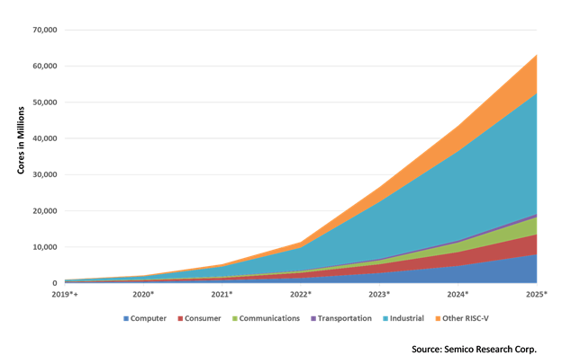
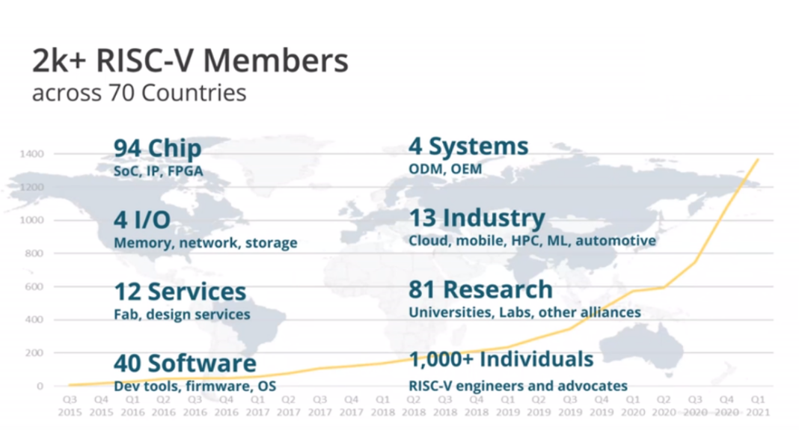
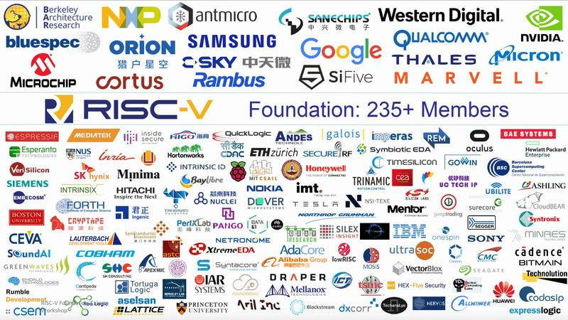

# 了解RISC-V

---

RISC-V既不是一家公司，也不是一款CPU的实现。RISC-V是一款高质量、免许可证、开放的RISC ISA，它并不属于特定的公司，而是由非营利的RISC-V基金会来维护，RISC-V的标准可访问https://risc.org，所有的厂商和个人都可以基于这套标准来开发自己的芯片。RISC-V ISA适用于所有类型的计算机系统，从微型计算机到超级计算机，有很广阔的应用场景。

## 1.RISC-V 的历史简介

RISC最早可追溯到1980年，在那之前，人们已经认识到越简单的计算机能够更加高效，但并没有人提出具体的设计原则。学术界热衷于研究简单高效的计算机，并在1990年设计出了RISC指令集DLX，这套指令集用于教学研究和爱好者，但从未真正用于商业部署，因而并未流行开来。那时ARM CPU指令集是主流指令集，它还支持当时流行的GCC编译器。OpenRISC是基于DLX的开放ISA，它完全支持GCC和Linux，但也同样很少用于商业中。

2010年，加州大学伯克利分校的Krste Asanović和他的几个研究生进行了一个"short, three-month project over the summer"，这个项目旨在帮助学术研究者和工业用户。David Patterson也加入了这个项目，他是Berkeley RISC的创始人。经过前期多年的研究和选型，发现现成的X86和ARM指令多而复杂，同时存在IP（[Intellectual Property](https://en.wikipedia.org/wiki/Intellectual_property)）问题，即知识产权问题，另外ARM在2010年之前还不支持64位，于是开发团队从头开始研发了RISC-V ISA。当时主要的研发人员有Andrew Waterman，Yunsup Lee，David Patterson, Krste Asanovic。

2011年RISC-V ISA作为开源发布，该ISA规划之后遵顼知识共享许可协议，允许外部贡献者通过RISC-V基金会和后来的RISC-V International进行完善。

2015年，RISC-V 基金会由硅谷相关公司发起并成立，获巨头企业及联盟支持下RISC-V 产业生态进入快速发展期。2020年由于国际形式的变化，RISC-V基金会将注册地从美国迁往瑞士，规避政治风险。

## 2.RISC-V 发展现状

分析机构Semico Research在其近来新发的，名为“RISC-V市场分析：新兴市场“的报告中给出了对RISC-V市场消费的预测，如下图：

Semico forecasts strong growth for RISC-V, predicting the market will consume 62.4 billion RISC-V CPU cores by 2025

由图可知，预计到2025年，市场将总共消费624亿个RISC-V CPU内核，其中预计工业领域将是最大的细分市场，拥有167亿个内核。Semico预测，在包括计算机，消费者，通讯，运输和工业市场在内的细分市场，RISC-V CPU内核的复合年增长率(CAGR)在2018年至2025年之间的平均复合年增长率将高达146.2%。

另一方面，在2015年RISC-V基金会成立之初，基金会由29个成员，而目前RISC-V成员已超过2000个，分布在70多个国家，其整体增长图如下：

RISC-V国际基金会成员示意图

由图可知，近年来RISC-V的成员数量快速增长，发展势头强劲。

## 3.RISC-V 的特点

RISC-V有以下特点：

+ 简单：RISC-V的规范设计的简单；复杂指令集构架为保证向后兼容性而不得不保留许多过时的定义，导致其指令数目多，指令冗余严重，文档数量庞大，所以要在这些架构上开发新的操作系统或者直接开发应用门槛很高。而RISC则通过模块化的方式，定义40条的基础指令，再加上其他几十条的模块化的扩展指令。
+ 模块化：一个核心的指令集加上一些扩展指令集；用户能够灵活选择不同的模块组合，来实现自己定制化设备的需要，比如针对于小面积低功耗嵌入式场景，用户可以选择RV32IC组合的指令集，仅使用Machine Mode（机器模式）；而高性能应用操作系统场景则可以选择譬如RV32IMFDC的指令集，使用Machine Mode（机器模式）与User Mode（用户模式）两种模式。
+ 稳定：指令集的功能相对稳定，需要修改变化的内容比较少；

+ 完整的工具链：RISC-V社区已经提供了完整的工具链，并且RISC-V基金会持续维护该工具链。当前RISC-V的支持已经合并到主要的工具中，比如编译工具链gcc, 仿真工具qemu等。

+ 完全开源：RISC-V基金会对指令集的使用不收取高额的授权费。开源采用宽松的[BSD协议](https://baike.baidu.com/item/BSD协议/8013651)，企业完全自由免费使用，同时也容许企业添加自有指令集拓展而不必开放共享以实现差异化发展。

## 4.RISC-V的软硬件生态

新指令集的一个常见问题是缺乏 CPU 设计和软件——这两个问题都限制了它的可用性.RISC-V 有大量的 CPU 设计。 RISC-V 软件包括工具链、操作系统、中间件和设计软件。

可用的 RISC-V 软件工具包括 GNU Compiler Collection (GCC) 工具链（带有 GDB，调试器）、LLVM 工具链、OVPsim 模拟器（和 RISC-V 快速处理器模型库）、Spike 模拟器和QEMU(RV32GC/RV64GC)。 

基于RISC-V的内核和片上系统现在超过上百款，例如伯克利大学开发的商业SiFive，我国自主研发的“香山”处理器核心等

## 参考资料：

RISC-V指令集开源软件生态：https://www.bilibili.com/video/BV1d3411u76H?share_source=copy_web

RISC-V - Wikipedia：https://en.wikipedia.org/wiki/RISC-V

RISC-V_百度百科：https://baike.baidu.com/item/RISC-V

